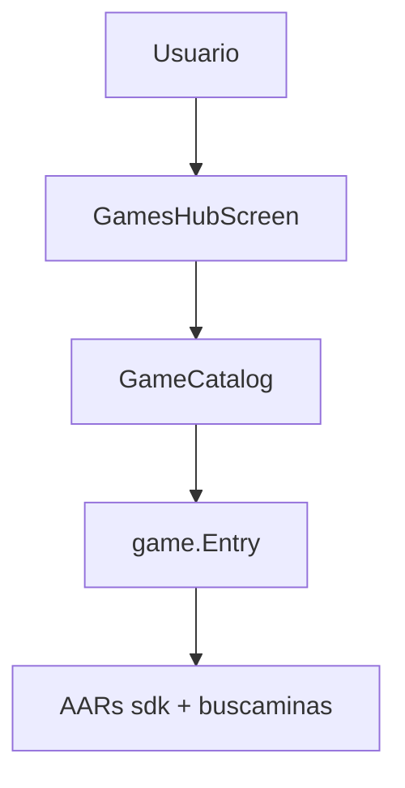
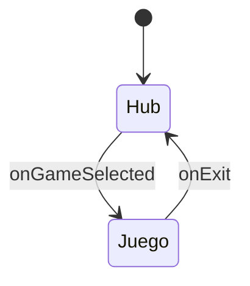
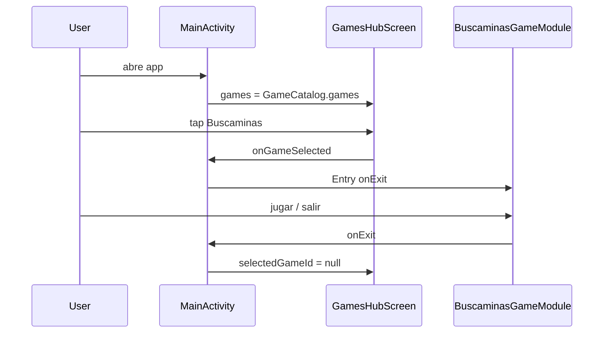
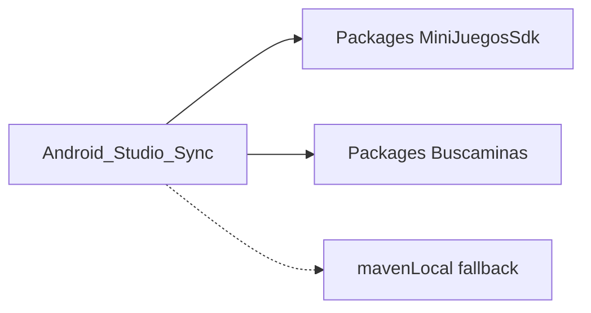
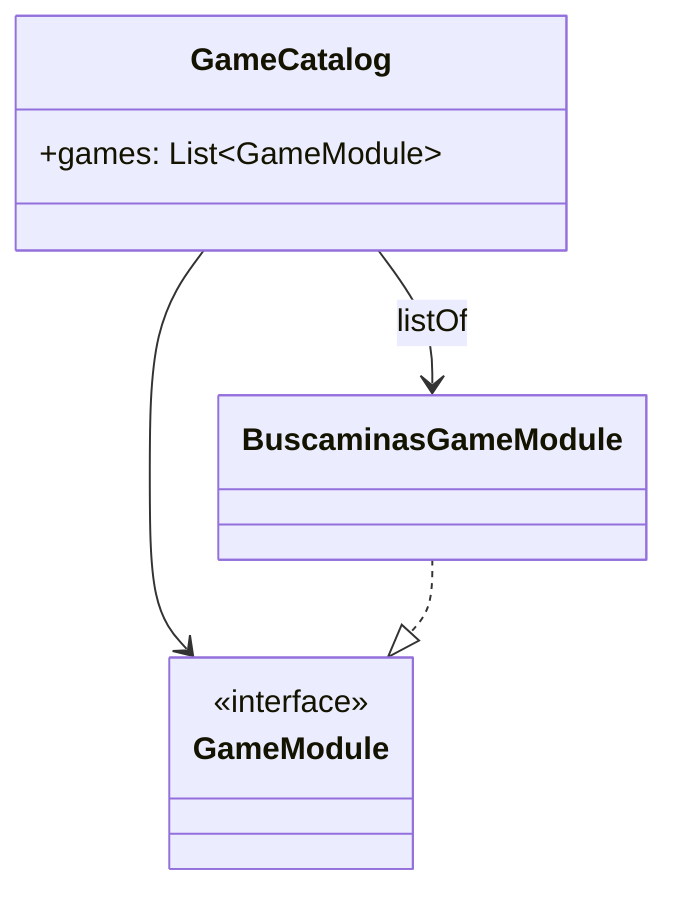

# Estructura — MiniJuegos (host)

## Rol



MiniJuegos solo se ocupa de:

1. Hub / catálogo  
2. Navegación a `GameModule.Entry`  
3. Tema de marca  
4. Declarar dependencias Maven  

La lógica del buscaminas **no** está en este repo.

## Árbol del proyecto

```
MiniJuegos/
├── .github/workflows/ci.yml
├── app/
│   └── src/main/java/pelkidev/com/mx/minijuegos/
│       ├── MainActivity.kt          # Hub ↔ Entry
│       ├── GameCatalog.kt           # Lista de GameModule
│       ├── presentation/
│       │   └── GamesHubScreen.kt
│       └── ui/theme/
├── settings.gradle.kts              # Repos GitHub Packages
├── build.gradle.kts                 # Sin caché de SNAPSHOT
└── docs/
    ├── ESTRUCTURA.md
    └── TUTORIAL.md
```

## Navegación host



Implementación actual (sin Navigation Compose): estado `selectedGameId` en `MainActivity`.



## Resolución de dependencias



Orden en `settings.gradle.kts`:

1. Google / Maven Central  
2. GitHub Packages (SDK)  
3. GitHub Packages (Buscaminas)  
4. `mavenLocal()` (fallback)

`cacheChangingModulesFor(0)` hace que cada sync pida de nuevo `1.0.0-SNAPSHOT`.

## Catálogo



Para un juego nuevo: dependencia Maven + una línea en `GameCatalog.games`.

## Qué no vive aquí

- Motor / UI interna de cada juego  
- Publicación de AARs de juegos  
- Definición de `GameModule` (está en el SDK)
