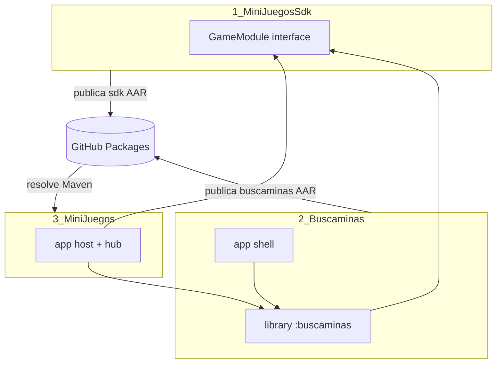
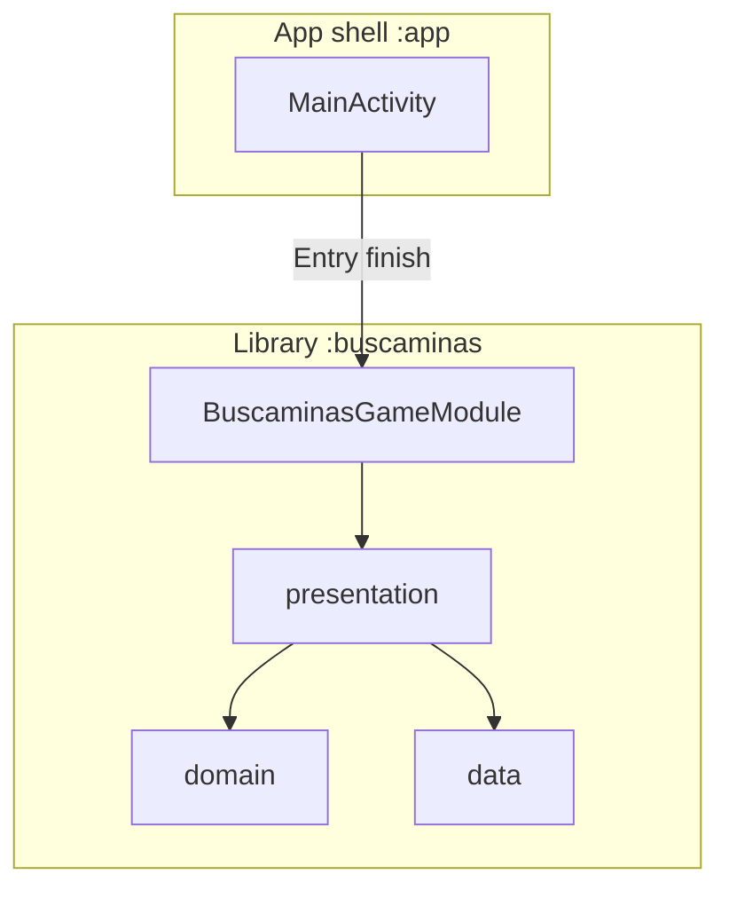
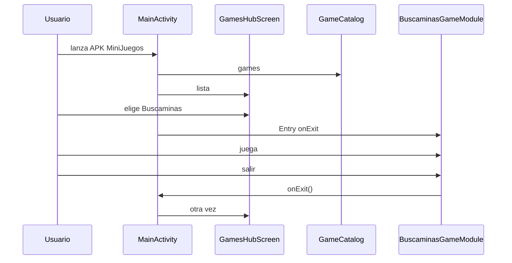
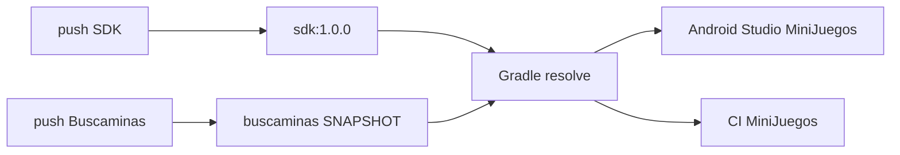
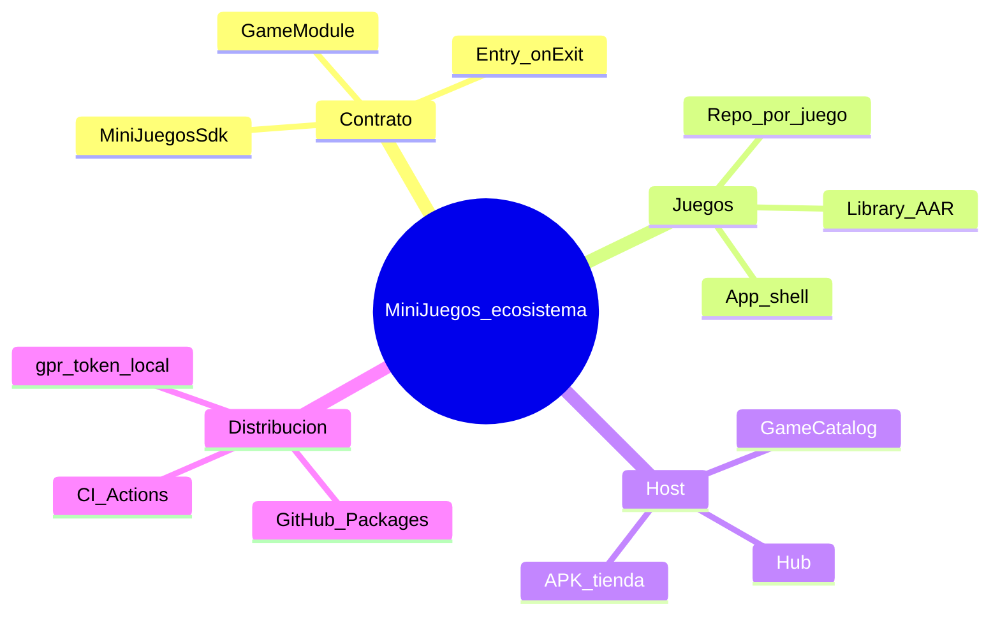

# Tutorial: cómo funciona MiniJuegos en conjunto

Guía paso a paso del ecosistema multi-repo: SDK + juegos (AAR) + app host.

Público objetivo: alguien que abre los tres proyectos por primera vez y quiere entender **qué hace cada pieza**, **cómo se conectan** y **cómo iterar** en el día a día.

---

## 1. Idea general (una frase)

**MiniJuegos** es una app que muestra un menú de juegos; cada juego es un **módulo Android Library** en **otro repositorio**, publicado como **AAR en GitHub Packages**, e integrado mediante un **contrato común** (`GameModule`) definido en **MiniJuegosSdk**.

---

## 2. Los tres repositorios



| # | Repo | Pregunta que responde |
|---|------|------------------------|
| 1 | [MiniJuegosSdk](https://github.com/AlejandroHP17/MiniJuegosSdk) | ¿Cómo se “enchufa” un juego al host sin conocer su código interno? |
| 2 | [Buscaminas](https://github.com/AlejandroHP17/Buscaminas) | ¿Dónde vive el juego y cómo se prueba solo? |
| 3 | [MiniJuegos](https://github.com/AlejandroHP17/MiniJuegos) | ¿Dónde está el menú y la APK que el usuario instala? |

---

## 3. Por qué no va todo en un solo repo

1. **Independencia:** puedes abrir Buscaminas en Android Studio, instalar su APK shell y probar sin compilar el host.  
2. **Límites claros:** el host no se ensucia con el motor del tablero.  
3. **Escala:** un segundo juego = otro repo + una línea en `GameCatalog`, no un monorepo gigante.  
4. **Versionado:** publicas `buscaminas:1.0.0-SNAPSHOT` sin liberar un APK nuevo del SDK.

El coste es el pipeline Maven (CI + credenciales). Ese es el “pegamento”.

---

## 4. El contrato: `GameModule`

Definido solo en el SDK:

```kotlin
interface GameModule {
    val id: String
    val title: String
    val description: String

    @Composable
    fun Entry(onExit: () -> Unit)
}
```

### Qué significa cada pieza

| Campo / método | Para el host | Para el juego |
|----------------|--------------|---------------|
| `id` | Clave de navegación / analytics | Debe ser estable (`"buscaminas"`) |
| `title` / `description` | Textos del hub | Copy de marketing del juego |
| `Entry(onExit)` | Sustituye la pantalla del hub | Monta toda la UI del juego |
| `onExit` | Vuelve al hub | Botón atrás / salir en pantalla inicio |

El host **nunca** importa `MinesweeperViewModel` ni el motor. Solo conoce `GameModule`.

Buscaminas implementa el contrato así:

```kotlin
object BuscaminasGameModule : GameModule {
    override val id = "buscaminas"
    // ...
    @Composable
    override fun Entry(onExit: () -> Unit) {
        BuscaminasTheme {
            MinesweeperScreen(onExit = onExit)
        }
    }
}
```

---

## 5. Anatomía de un juego (Buscaminas)



### Dos modos de ejecución del mismo código

| Modo | Quién llama a `Entry` | `onExit` hace |
|------|----------------------|---------------|
| Standalone (`:app`) | `MainActivity` del repo Buscaminas | `finish()` de la Activity |
| Embebido (MiniJuegos) | `MainActivity` del host | Limpia `selectedGameId` y muestra el hub |

Misma library, dos “cascarones”.

### Capas (resumen)

1. **domain** — reglas del buscaminas (sin Android).  
2. **data** — guardar partida.  
3. **presentation** — Compose + ViewModel.  
4. **BuscaminasGameModule** — fachada hacia el ecosistema MiniJuegos.

---

## 6. Anatomía del host (MiniJuegos)



### Archivos clave

| Archivo | Responsabilidad |
|---------|-----------------|
| `GameCatalog.kt` | `listOf(BuscaminasGameModule, …)` |
| `GamesHubScreen.kt` | UI del menú |
| `MainActivity.kt` | Alterna hub ↔ `Entry` |
| `settings.gradle.kts` | Dónde bajar los AAR (GitHub Packages) |
| `app/build.gradle.kts` | `implementation("…:buscaminas:…")` |

---

## 7. El pegamento: Maven / GitHub Packages



### Coordenadas actuales

| Artefacto | URL del registry |
|-----------|------------------|
| `…:sdk:1.0.0` | `maven.pkg.github.com/AlejandroHP17/MiniJuegosSdk` |
| `…:buscaminas:1.0.0-SNAPSHOT` | `maven.pkg.github.com/AlejandroHP17/Buscaminas` |

### Autenticación

GitHub Packages **siempre** pide usuario + token (aunque el repo sea público).

- **CI:** secret `GH_PACKAGES_TOKEN` (PAT con `read:packages`; en repos que publican también `write:packages`).  
- **Android Studio local:** `~/.gradle/gradle.properties`:

```properties
gpr.user=AlejandroHP17
gpr.token=ghp_xxx
```

Sin eso verás `401 Unauthorized` al sincronizar.

---

## 8. Tutorial práctico A → Z (primera vez)

### Paso 1 — Credenciales en tu máquina

1. Crea un PAT classic con `read:packages` (y `write:packages` si publicas a mano).  
2. Añádelo a `~/.gradle/gradle.properties` como arriba.  
3. En GitHub, el mismo PAT (o uno equivalente) como secret `GH_PACKAGES_TOKEN` en Buscaminas y MiniJuegos.

### Paso 2 — Verificar que el SDK está publicado

1. Abre [MiniJuegosSdk → Actions](https://github.com/AlejandroHP17/MiniJuegosSdk/actions).  
2. El último run en `main` debe estar verde.  
3. En el repo, sección **Packages**, debe existir `sdk`.

Si no hay package: push vacío o *Re-run* del workflow del SDK.

### Paso 3 — Verificar Buscaminas

1. Clona / abre Buscaminas.  
2. Opcional: `./gradlew :app:installDebug` y juega en standalone.  
3. Confirma Actions verde en `main` (publicó el AAR).

### Paso 4 — Abrir MiniJuegos en Android Studio

1. Sync Project (debe resolver `sdk` y `buscaminas` desde Packages).  
2. Run en emulador/dispositivo.  
3. Debes ver el hub → tap Buscaminas → juego → atrás vuelve al hub.

### Paso 5 — Hacer un cambio y verlo en el host

1. En Buscaminas, cambia un texto visible (por ejemplo el subtítulo).  
2. Commit + push a `main`.  
3. Espera CI verde de Buscaminas (publica SNAPSHOT).  
4. En MiniJuegos: **Sync Project** o Run.  
5. El SNAPSHOT se reconsulta (caché de changing modules = 0) y el cambio aparece.

No necesitas `publishToMavenLocal` en este flujo.

---

## 9. Tutorial: añadir un segundo juego (checklist)

Supón un juego nuevo `TresEnRaya` en su propio repo.

1. **Repo del juego** con `:tresenraya` (library) + `:app` (shell).  
2. Dependencia `api("…:sdk:1.0.0")`.  
3. `object TresEnRayaGameModule : GameModule { … Entry … }`.  
4. CI que publique `pelkidev.com.mx.minijuegos:tresenraya:1.0.0-SNAPSHOT`.  
5. En **MiniJuegos** `settings.gradle.kts`: maven repo del nuevo GitHub Packages.  
6. En `app/build.gradle.kts`: `implementation("…:tresenraya:1.0.0-SNAPSHOT")`.  
7. En `GameCatalog`: `listOf(BuscaminasGameModule, TresEnRayaGameModule)`.  
8. Sync + Run.

El hub no necesita conocer pantallas internas del nuevo juego.

---

## 10. Flujos alternativos (cuándo usar cada uno)

| Situación | Qué hacer |
|-----------|-----------|
| Iterar UI del juego sin esperar CI | `./gradlew :buscaminas:publishToMavenLocal` y Sync en MiniJuegos (`mavenLocal` es fallback) |
| Probar solo el juego | Instalar `:app` de Buscaminas |
| Entregar cambio al host “oficial” | Push Buscaminas → CI Packages → Sync MiniJuegos |
| Cambiar el contrato (`GameModule`) | Subir major del SDK → actualizar dependencias en juegos y host → republicar |

---

## 11. Fallos frecuentes

| Síntoma | Causa probable | Qué revisar |
|---------|----------------|-------------|
| `401` al resolver AAR | Token vacío / sin `read:packages` | `gpr.token`, secret `GH_PACKAGES_TOKEN` |
| Sync OK pero no ves cambio del juego | CI de Buscaminas aún no publicó / caché | Actions verde; Sync de nuevo |
| Compila host pero falta clase `GameModule` | SDK no resuelto | Dependencia `sdk:1.0.0` y repo Packages del SDK |
| Colisión de recursos `R` | Strings sin prefijo en un library | `resourcePrefix` / nombres `buscaminas_*` |
| Juego abre bien solo, no en host | No registraste el módulo | `GameCatalog` + `implementation` del AAR |

---

## 12. Mapa mental final



Si entiendes estas cuatro cajas —**contrato, juego-AAR, host, packages**— ya entiendes el sistema completo.

---

## 13. Enlaces rápidos

- Estructura SDK: [MiniJuegosSdk/docs/ESTRUCTURA.md](https://github.com/AlejandroHP17/MiniJuegosSdk/blob/main/docs/ESTRUCTURA.md)  
- Estructura Buscaminas: [Buscaminas/docs/ESTRUCTURA.md](https://github.com/AlejandroHP17/Buscaminas/blob/main/docs/ESTRUCTURA.md)  
- Estructura Host: [ESTRUCTURA.md](./ESTRUCTURA.md)  
- READMEs: [SDK](https://github.com/AlejandroHP17/MiniJuegosSdk#readme) · [Buscaminas](https://github.com/AlejandroHP17/Buscaminas#readme) · [MiniJuegos](https://github.com/AlejandroHP17/MiniJuegos#readme)
